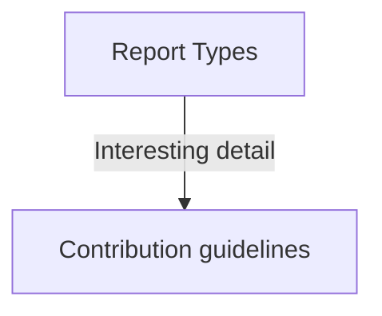

# README Test #

### Test Sweet Flow chart!

[Report Types](#Report-Types)

### What is this repository for? ###
This project is for better discovery of SSIS packages. It models the SSIS packages, writes reports, and generates lists of dependent tables. 

### How do I get set up? ###

This is C# application. You need to [install .NET Core](https://dotnet.microsoft.com/en-us/download). If you use VS Code, you will want to install the [C# for Visual Studio Code](https://marketplace.visualstudio.com/items?itemName=ms-dotnettools.csharp) extension.

Put the SSIS packages that you want to parse in the SSIS folder under the `input` folder. Script key database views, tables and stored procedures; one file per object into `database` under the `input` folder. The parser is only equiped to parse files in the way that SQL Server generates them using Tasks->Generate Scripts (use the "one file per object" option). There should be one subfolder for every database.

This is a console application. There are generic configs for the different parsing jobs that you can run under the `config/template` folder. Copy the template folder and name the new folder after your customer and place that folder under config. You can then tweak the config for your customer's needs. 

SECURITY NOTE: Do NOT check this folder in to the repo as it could contain sensitive information about your customer. Also, do NOT check in anything that you would put in your input folder or generate to your output folder. Keep a backup of these folders in a customer-ordained secure place and only use it locally on a customer approved device. If you have a need for change control on customer stuff, talk to your team and the customer about copying this code into a customer controlled repo. 
tl;dr DON'T CHECK IN CUSTOMER STUFF INTO THE PHDATA REPO. 

To get SSIS reports on all the packages you would run: 
`dotnet run config/<CustomerName>/PackageDependencies_TableReports.xml`

### Report Types

There are two different action classes. `SsisPackageReports` and `PackageDependencies` they both rely on genrating a `SsisSolution` object that is built by looking at an SSIS Solution folder. It then creates a list of `SsisPackage` objects

#### SSIS Package Reports
Creates a report written in SQL describing the SSIS packages in a folder

#### Package PackageDependencies
There are several kinds of reports to help better understand the underlying table dependencies required to build

### Viewing Markdown
Most of the reports are written in Markdown. In order to show visual flowcharts, Mermaid was used. However, this is not supported by default in most Markdown viewers.

### Contribution guidelines ###
Try to keep the SSIS models (in the `models` folder) generic to all SSIS packages. Use the `actions` folder to put your querying. The Program.cs should only route the args to the correct action and run it. For extra credit try using [C# SQL-like LINQ syntax](https://www.c-sharpcorner.com/article/linq-for-beginners/) to help Data Engineers feel warm and cozy. For consistency, use the LINQ-to-XML libraries (XElement) for XML parsing. 

### Flat File Source

Microsoft.FlatFileSource:

Flat File Source

